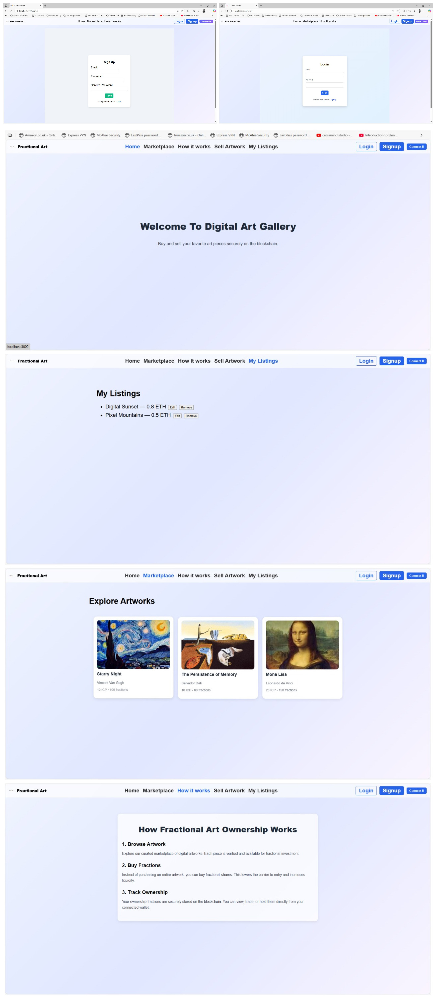

# Blockchain-Based-Art-Co-Ownership 🎨

This platform leverages the **Internet Computer Protocol (ICP)** to tokenize art pieces, enabling users to **buy, sell, or trade fractional ownership** in high-value artworks. By fractionalizing art ownership, it democratizes access to the world of art investments, making it accessible to everyone.

## 🚀 Features

- **Art Tokenization**: Convert physical or digital artworks into fractionalized, tradable tokens.

- **Fractional Ownership**: Users can buy and hold shares of premium artworks.

- **Marketplace**: Buy, sell, or trade your art fractions in a decentralized marketplace.

- **Secure & Transparent**: Built on the **Internet Computer Protocol (ICP)** for immutable and secure transactions.

- **Responsive UI**: A modern and seamless experience on any device.

- **Real-Time Valuation**: Dynamic updates on the current market value of each artwork.

- **Wallet Integration**: Connect with Internet Identity for secure authentication and transactions.

- **Role-Based Access**: Separate features for Artists, Collectors, and Investors.

## Tech Stack

### Frontend
- **React 19** - A JavaScript library for building user interfaces.
- **Vite** - Fast build tool for modern web applications.
- **Tailwind CSS** - Utility-first CSS framework for styling.
- **React Router DOM** - Client-side routing.
- **Axios** - API communication with canisters.
- **Lucide-react** - Icon library.
- **React-hot-toast** - Toast notifications.
- **Internet Identity SDK** - Authentication with ICP.

### Backend
- **Rust** - For building high-performance, memory-safe canisters.
- **ICP Canisters** - Smart contracts deployed on the Internet Computer.
- **Candid** - Interface description language for canisters.
- **Dfinity SDK (dfx)** - To deploy and manage canisters.
- **Serde & Candid Rust Crates** - Data serialization/deserialization.

## Screenshots

## Screenshots



## Project Installation

### Prerequisites
- **Node.js** (>=18.x)
- **Rust** (with cargo)
- **Dfinity SDK (dfx)**: [Install here](https://internetcomputer.org/docs/current/developer-docs/setup/install/)
- **ICP Wallet / Internet Identity**

---

### Clone the Project

```bash
git clone https://github.com/Sonuku4564/Blockchain-Based-Art-Co-Ownership.git
cd Blockchain-Based-Art-Co-Ownership
```

If you want to start working on your project right away, you might want to try the following commands:

```bash
dfx help
dfx canister --help
```

## Running the project locally

If you want to test your project locally, you can use the following commands:

```bash
# Starts the replica, running in the background
dfx start --background

# Deploys your canisters to the replica and generates your candid interface
dfx deploy
```

Once the job completes, your application will be available at `http://localhost:4943?canisterId={asset_canister_id}`.

If you have made changes to your backend canister, you can generate a new candid interface with

```bash
npm run generate
```

at any time. This is recommended before starting the frontend development server, and will be run automatically any time you run `dfx deploy`.

If you are making frontend changes, you can start a development server with

```bash
npm start
```

Which will start a server at `http://localhost:8080`, proxying API requests to the replica at port 4943.

### Note on frontend environment variables

If you are hosting frontend code somewhere without using DFX, you may need to make one of the following adjustments to ensure your project does not fetch the root key in production:

- set`DFX_NETWORK` to `ic` if you are using Webpack
- use your own preferred method to replace `process.env.DFX_NETWORK` in the autogenerated declarations
  - Setting `canisters -> {asset_canister_id} -> declarations -> env_override to a string` in `dfx.json` will replace `process.env.DFX_NETWORK` with the string in the autogenerated declarations
- Write your own `createActor` constructor
